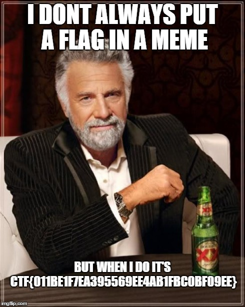

We need Wireshark for this challenge (there are more ways, but that's the easiest).
In Wireshark, right click and select **decode as..**
Then select `Teredo` for the udp stream.
After that,  we have to follow the TCP stream and can see an HTTP Request and the data of the response.
We extract the response and get a meme with the flag.

